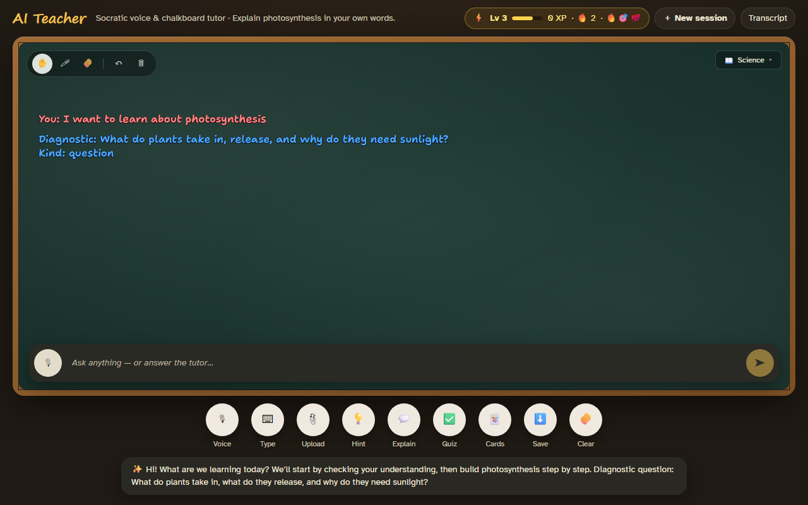
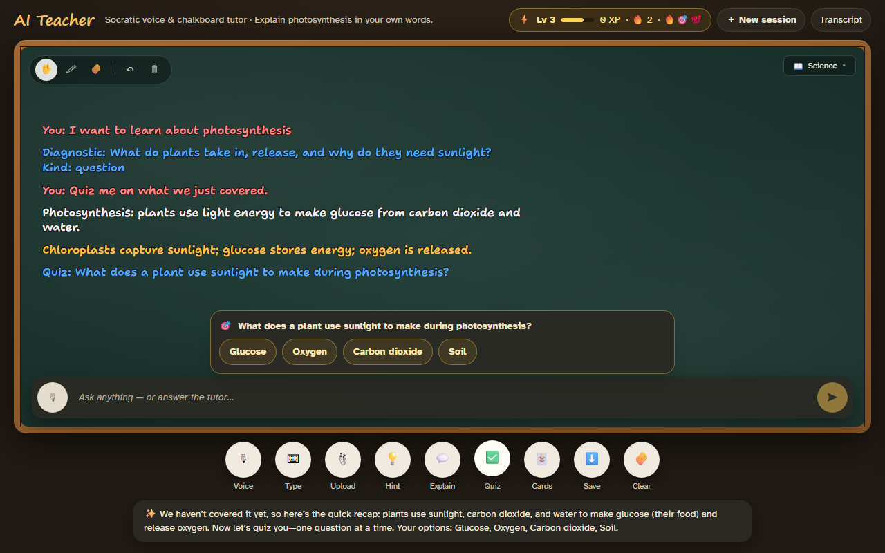
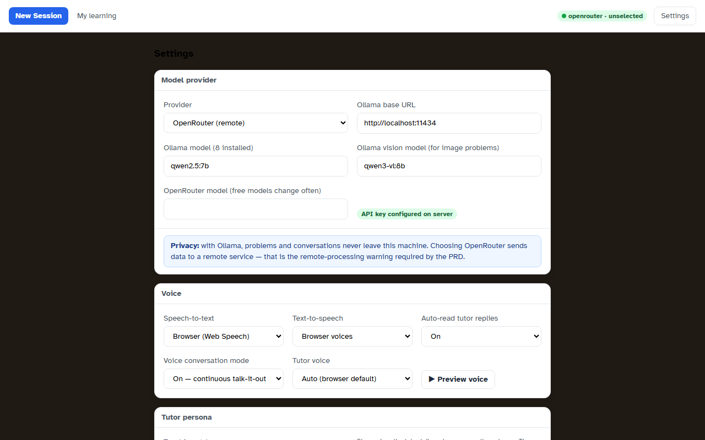
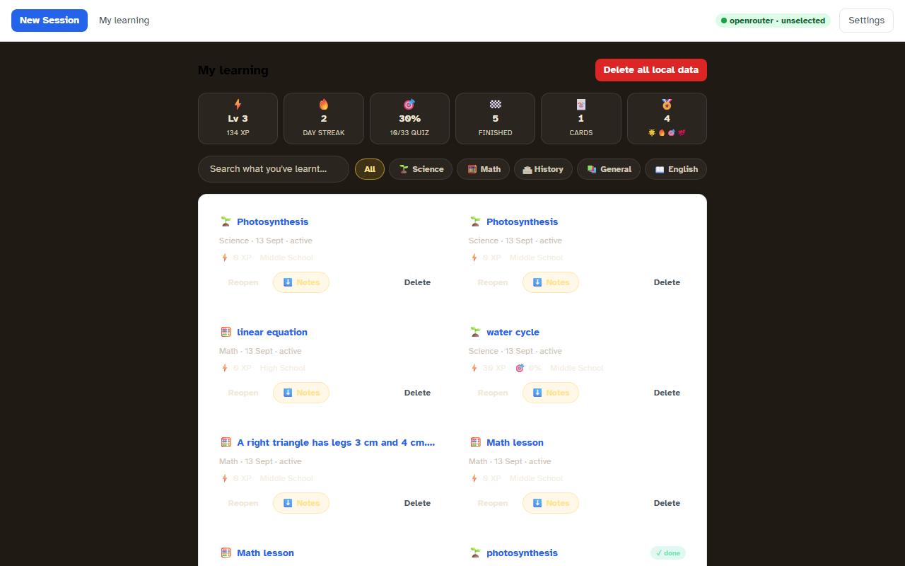
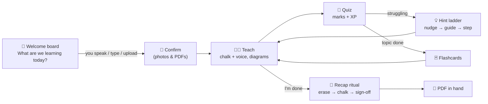

<div align="center">

# 🧑‍🏫 AI Teacher — the chalkboard tutor

### Your own live tutor. On a real chalkboard. In any subject.

**It talks. It writes with chalk while it talks. You just answer out loud — like a real lesson.**

[](https://nodejs.org)
[](https://www.typescriptlang.org)
[](https://react.dev)
[](#-privacy--safety)
[](#-contributing)
[](LICENSE)
[](https://github.com/Dostam/local-live-tutor/actions/workflows/ci.yml)
[](CONTRIBUTING.md)
[](#-quick-start-2-minutes)

**Math · Science · English · History · Geography · CS · Languages — anything you're studying**

*[Quick start](#-quick-start-2-minutes) · [Screenshots](#-see-it-in-action) · [How a lesson works](#-how-a-lesson-works) · [Why it's different](#-why-its-different)*

</div>

---

<div align="center">
<picture>
  <source media="(prefers-reduced-motion: reduce)" srcset="docs/screenshots/01-welcome.png"/>
  
</picture>
<p><em>▲ An actual lesson, animated — the tutor chalks the topic, teaches it in color-coded chalk, and quizzes you. <sub>(Static fallback shown if your OS requests reduced motion.)</sub></em></p>
</div>

No sign-up. No forms. You open the app and a chalkboard asks:

> **"What are we learning today?"**

You *say* it, *type* it, or *upload a photo/PDF* of your homework — and the tutor starts teaching. That's the whole onboarding.

**New Session is the home screen.** Every visit opens on a fresh welcome board — nothing is created until you actually speak, type, or upload. Your lessons live one click away under *My learning*.

---

## 🎬 See it in action

<div align="center">
<table>
<tr>
<td width="50%">

**Live lesson — the tutor talks and chalks.**
Every key point is written on the board while it's spoken, in color-coded chalk: questions in blue, facts in white, answers in green, your own words in pink.



</td>
<td width="50%">

**Quizzes with real marks.**
The tutor decides when you're ready and quizzes you — multiple-choice buttons or spoken open questions — grades honestly, and awards XP.



</td>
</tr>
<tr>
<td width="50%">

**A tutor with personality.**
Friendly, calm, sweet, sarcastic, Gen-Z, or strict-teacher — same great teaching, the tone you learn best with. And pick the voice: **female, male, or auto**.



</td>
<td width="50%">

**My learning — everything you've studied.**
XP, level, day streak, quiz accuracy, badges, search, subject filters, and a one-click PDF of every lesson.



</td>
</tr>
</table>
</div>

---

## 🤔 Why it's different

Most AI study tools are chat boxes. **AI Teacher is a classroom.**

| | Typical chatbot tutor | 🧑‍🏫 AI Teacher |
|---|---|---|
| **Interaction** | Type messages, read walls of text | **Talk out loud** — continuous voice conversation, like a real lesson |
| **Memory of the lesson** | Scroll back through chat | A **chalkboard**: the tutor writes each step while speaking; it's the lesson's persistent memory |
| **When you forget the question** | Re-scroll | It's **still on the board** |
| **Your thinking** | Buried in the log | Your words are **chalked in pink** — right or wrong — with a why line under them |
| **Pictures** | Rarely | The tutor **draws diagrams** when a picture helps you understand |
| **Motivation** | None | **XP, levels, streaks, badges** — earned with real quiz marks |
| **The ending** | …nothing | The tutor **erases the board, chalks a recap, and signs off** — then hands you the lesson as a **PDF** |

And the core principle, always: **it guides you to the answer — it doesn't hand it to you.** Hints escalate step by step, it quizzes before revealing, and it explains fully only when you ask.

---

## ✨ What it does

- 🗣️ **Talk it out** — continuous voice conversation with automatic turn detection (~1.2s of silence sends your turn), live captions, echo control (the mic pauses while the tutor speaks), and barge-in (interrupt anytime). Interject with questions mid-explanation — it's a conversation, not messages.
- 🖍️ **A chalkboard that remembers** — every question, fact, answer, and explanation is chalked in its own color. Text wraps and scrolls like a real blackboard. Your words land in pink before the tutor responds, with a ✓/✗ why-line when graded.
- 📸 **Photo & PDF homework** — snap your worksheet, upload it, confirm what the tutor read (nothing starts without your OK), and learn from it. Free vision models do the reading.
- 🎯 **Self-driving lessons** — the tutor decides the moment to quiz, hint, explain fully, or deal flashcards. It classifies the subject itself (photosynthesis → Science, WWII → History) and updates the pill live.
- 🃏 **Quizzes, flashcards & marks** — multiple-choice or spoken, graded honestly with a server-side fallback so an answer is never lost. Voice-driven flashcards with mastery tracking across sessions.
- 🏆 **Gamified** — XP, levels every 50 XP, answer streaks, daily streaks, six badges, and encouragement notes that escalate from "🎉 You're doing great!" to "⚡ UNSTOPPABLE!"
- 🎭 **Six personas, three voices** — friendly, calm, sweet, sarcastic, genz, or strict; female, male, or auto voice. Change it mid-lesson from the 📖 pill.
- 🧭 **Reads the room** — with adaptive persona on, a struggling stretch drops the jokes and slows down; a cruising stretch celebrates and raises the challenge. Tone flexes, teaching never does.
- ⏰ **Patient, like a real tutor** — step away or think for a while and the tutor gently checks in after a quiet spell ("Take your time — I'm here when you're ready"), spoken like a person, never a timeout. It never marks you wrong, never spoils the answer, and fires at most once until you're back. Tunable in Settings (1–5 minutes, or off).
- 🌍 **Multilingual lessons** — 13 languages including Spanish, French, German, Hindi, Chinese, Japanese, Arabic, and Hebrew. "Match my language" mirrors whatever you speak or type; pin a language from the 📖 pill (or Settings) to lock the whole lesson in it — teaching, board chalk, quizzes, flashcards, and the tutor's voice all switch. Hindi lessons speak Hindi math ("जमा", "बराबर"), split sentences on the danda (।), and the mic listens in that language from the very first word on the welcome board. No OS voice pack for your language? Install a Piper voice model (below) and lessons speak it **fully offline**.
- ↔️ **Right-to-left lessons** — Arabic and Hebrew get a mirrored chalkboard: the chalk column flows right-to-left, text is right-aligned, and every text surface (captions, quiz card, answer box) renders bidi correctly with `dir=auto`. The tutor is prompted to write naturally RTL, punctuation on the left.
- 🔊 **Offline voices (Piper)** — run a local [Piper](https://github.com/rhasspy/piper) HTTP server, drop voice models in the voices folder, and languages your OS has no voice for (Arabic, Hebrew, Hindi…) are spoken by Piper — no internet, no cloud TTS. Settings shows exactly which languages have offline voices installed.
- 👨‍👩‍👧 **Multi-student profiles** — everyone at the chalkboard keeps their own defaults, lessons, XP, and streaks. Switch learners from the header; no accounts needed.
- 📊 **Engagement patterns for parents** — the Parent view shows when each student goes quiet (and for how long), when they come back, and how that differs per subject — real data from the tutor's gentle check-ins, framed as thinking time, not trouble.
- 🧠 **Lessons remember how they were taught** — persona, voice, and language are saved *per lesson*, so reopening an old session picks up exactly the tutor you left.
- 🖼️ **Illustrations on demand** — the tutor pins generated diagrams and portraits into the chalk flow wherever a picture genuinely helps.
- 📄 **PDF export** — one click downloads the full lesson: question overview → answers with verdicts → step-by-step explanation → color-coded board log → conversation → quiz results → study journey.
- 🧹 **A real ending** — say *"I'm done"* and the tutor erases the board, chalks a compact recap while speaking the sign-off, then reveals the download. No Finish button needed.
- ⏸️ **Auto-saved when life happens** — walk away mid-lesson and after ~10 quiet minutes the lesson gently closes itself: the History tab gets a "⏸ paused" badge, the board gains a friendly "we paused here — your board is saved" chalk note, and **nothing is lost**. Come back, say anything, and the lesson reopens exactly where you left off — the tutor even recaps the last board step first.
- 🔒 **Private by default** — no accounts, no analytics, everything in one local SQLite file, one-click *Delete all local data*. Or go fully offline with Ollama.

---

## 🚀 Quick start (2 minutes)

```bash
# 1. Get the code & install
git clone <your-fork-url> local-live-tutor && cd local-live-tutor
pnpm install

# 2. Add a free OpenRouter key (no credit card, real free models)
echo "OPENROUTER_API_KEY=sk-or-..." > apps/backend/.env

# 3. Run
pnpm dev
```

Open **http://localhost:5173** → the chalkboard asks what you're learning → start talking. 🎉

> **Requires:** Node.js ≥ 20 and pnpm ≥ 9 (`npm i -g pnpm` or `corepack enable`).
> A free API key: [openrouter.ai/keys](https://openrouter.ai/keys)

<details>
<summary><b>🌀 Fully offline alternative (Ollama)</b></summary>

```bash
ollama serve
ollama pull qwen2.5:7b          # tutoring model
ollama pull qwen2.5vl:7b        # vision model for photo homework
```

Then in `apps/backend/.env`:

```env
LLM_PROVIDER=ollama
OLLAMA_BASE_URL=http://localhost:11434
OLLAMA_MODEL=qwen2.5:7b
OLLAMA_VISION_MODEL=qwen2.5vl:7b
```

Nothing leaves your machine. Settings shows a warning whenever a remote provider is active.

</details>

<details>
<summary><b>🔊 Offline voices for any language (Piper)</b></summary>

Browser voice packs don't cover every language. [Piper](https://github.com/rhasspy/piper) is a fast, local neural TTS — download a voice model for your language and the tutor speaks it fully offline:

```bash
# 1. Run the Piper HTTP server with any installed voice
pip install piper-tts
python -m piper.http_server -m ar_JO-kareem.onnx   # or he_IL, hi_IN, …

# 2. Point the tutor at it (apps/backend/.env)
echo "PIPER_TTS_URL=http://localhost:8080" >> apps/backend/.env
```

Voice models go in `apps/backend/data/piper-voices/` (one `.onnx` + `.onnx.json` per voice). The app scans that folder, lists exactly which languages have offline voices in **Settings → Voice**, and automatically speaks a pinned lesson through Piper whenever the browser has no native voice for it — browser voices stay first-choice, Piper fills the gap, and nothing ever falls back to fake audio.

</details>

<details>
<summary><b>⚙️ All configuration options</b></summary>

`apps/backend/.env` (all optional — sensible defaults):

| Variable | Default | What it does |
|---|---|---|
| `LLM_PROVIDER` | `openrouter` | `openrouter` or `ollama` |
| `OPENROUTER_API_KEY` | — | Server-side only; the browser never sees it |
| `OPENROUTER_FREE_MODELS` | auto | Comma-separated allowlist; order = preference |
| `OLLAMA_BASE_URL` | `http://localhost:11434` | Local Ollama endpoint |
| `OLLAMA_MODEL` / `OLLAMA_VISION_MODEL` | — | Pinned local models |
| `PORT` | `8787` | Backend port |
| `DATABASE_URL` | `./data/tutor.sqlite` | All data lives here |
| `SWEEP_ABANDONED_MINUTES` | `60` | Auto-cleanup for sessions that never started; `0` disables |
| `PIPER_TTS_URL` | — | Local Piper HTTP server for offline TTS voices; unset = off |
| `PIPER_VOICES_DIR` | `./data/piper-voices` | Voice-model folder scanned for per-language availability |

Persona, voice, and lesson language are set in the app (Settings or the 📖 pill — including on the welcome board *before* the first word) and persist in the database — per profile as defaults, per lesson as memory.

</details>

---

## 🎓 How a lesson works



1. **The greeting is free.** Nothing is created until you actually say, type, or upload something — idle visits leave no trace.
2. **You steer by talking.** Ask anything at any moment; the answer bar and mic are always live.
3. **The board is the lesson.** Questions, facts, steps, verdicts — chalked in color as they're spoken, and referenced naturally ("look at the second line on the board…").
4. **Honest marks.** Quizzes are graded against the exact question asked; a deterministic fallback grader means your answer is never swallowed by a model hiccup.
5. **It finishes like a teacher, not a chat.** Erase → recap card → spoken sign-off → PDF.

---

## 🛠️ Tech stack

| Layer | Technology |
|---|---|
| Frontend | React 18 + TypeScript + Vite · Tailwind CSS · Zustand · **tldraw** chalkboard · KaTeX |
| Backend | Node.js + TypeScript · Fastify · **SSE streaming** |
| Database | SQLite (WAL) via Drizzle ORM |
| Validation | Zod — the same schemas validate the API, the DB, **and the model's output** |
| AI | OpenRouter **free-model pool** (auto-resolved from the live catalog, rotated with cooldowns, dedicated free vision pool) or local Ollama |
| Testing | Vitest (unit + integration) · Playwright (E2E) |

**Architecture in one sentence:** every model reply is streamed, schema-validated, repaired once if malformed, and reduced to typed whiteboard operations — the model can *never* emit code or touch your DOM; it can only chalk.

<details>
<summary><b>📖 Architecture decisions (ADRs)</b></summary>

- [ADR-0001](docs/adr/ADR-0001-monorepo-and-contracts.md) — Monorepo split
- [ADR-0002](docs/adr/ADR-0002-whiteboard-op-log.md) — Store-owned whiteboard operation log
- [ADR-0003](docs/adr/ADR-0003-structured-output-pipeline.md) — Validation/repair pipeline
- [ADR-0004](docs/adr/ADR-0004-provider-seam-and-privacy.md) — Provider seam (`LLMProvider` interface)
- [ADR-0005](docs/adr/ADR-0005-chalkboard-voice-ux.md) — Chalkboard-first voice UX
- [ADR-0006](docs/adr/ADR-0006-free-model-pool-and-mockup-ui.md) — Free-model pool + mockup UI
- [ADR-0007](docs/adr/ADR-0007-gamified-study-stats.md) — Gamified study stats
- [ADR-0008](docs/adr/ADR-0008-photo-of-homework-entry.md) — Photo-of-homework entry
- [ADR-0011](docs/adr/0011-tutor-persona-and-voice.md) — Tutor persona & voice selection

The key seam: tutoring logic never knows which provider is in use. The bundled mock exists **only** behind that seam for the automated suites.

</details>

---

## ✅ Development

```bash
pnpm test        # all unit + integration tests (deterministic mock, no key needed)
pnpm typecheck   # strict TypeScript across the monorepo
pnpm e2e         # Playwright E2E (boots isolated servers on test ports)
pnpm build       # build every package
```

Every push and pull request runs the same gates in CI — typecheck, unit tests, and Playwright E2E — so the badges above always reflect a verified state.

The README's own imagery is regenerable — with the dev servers running:

```bash
pnpm --filter @local-live-tutor/frontend shots      # re-capture the five screenshots
pnpm --filter @local-live-tutor/frontend hero-gif   # re-capture the animated hero (needs ffmpeg on PATH)
```

## 🤝 Contributing

PRs are very welcome! The bar: `pnpm typecheck && pnpm test && pnpm e2e` green, no runtime mock data, free models only, and the key stays server-side. **Start with [CONTRIBUTING.md](CONTRIBUTING.md)** — it covers setup, the hard product rules, the test gates, and where tests live. Licensed under [MIT](LICENSE).

CI (`.github/workflows/ci.yml`) runs the same gates on every push and PR — **typecheck**, **unit tests**, and **E2E** (Playwright boots its own mock-provider servers, so no secrets live in CI) — with the Playwright report uploaded as an artifact when E2E fails.

The suites are fully offline and deterministic. **The mock provider is test-only infrastructure** — it cannot be selected in Settings, and no user-facing session is ever faked.

---

## 🔐 Privacy & safety

- 🗄️ All data in one local file: `apps/backend/data/tutor.sqlite` — deleted with one click.
- 🔑 API keys live server-side only; the API exposes a boolean, never the key.
- 🚫 No accounts, no ads, no analytics, no sharing features.
- 🛡️ The system prompt enforces age-appropriateness, no shaming, no medical/legal certainty, crisis → trusted adult, and academic-integrity behavior (never "I won't tell you" then telling you anyway).

---

## 🗺️ Roadmap

**Shipped**

- [x] Adaptive persona — the tutor reads the room (encouraging when you're stuck, playful when you're cruising)
- [x] Multilingual lessons — 13 languages with matching STT/TTS, native math speech (जमा/बराबर in Hindi), danda/CJK sentence splitting, and language-first voice resolution
- [x] Language-accurate offline voices — bundled-Piper integration: per-language voice models speak lessons fully offline when no OS voice pack exists
- [x] RTL board layout — right-to-left chalk flow for Arabic/Hebrew lessons (mirrored column, right-aligned text, bidi-safe UI)
- [x] Append-only chalkboard — the full session stays on the board; wrong answers keep their ✗ and can be retried (both attempts remain)
- [x] Inactivity nudge — a gentle, spoken "still there?" after a configurable quiet spell; never rushes, never reveals, fires once until the student returns
- [x] Natural speech layer — math notation becomes spoken words, markup/UI labels never reach TTS, breath-pause pacing
- [x] Per-session persona & voice memory when reopening old lessons
- [x] Multi-student local profiles
- [x] Handwriting practice — the student chalks the answer on the board themselves and the tutor grades the handwriting
- [x] Spaced-repetition review — due flashcards resurface as a warm-up at the start of a new lesson
- [x] Homework import from Google Classroom / Moodle links
- [x] Parent view — a weekly summary of what each student studied, with accuracy per subject
- [x] Engagement patterns — quiet spells, resume times, and per-subject comparisons recorded from the tutor's inactivity check-ins
- [x] Ollama vision parity — photo-of-homework reading fully offline
- [x] Idle auto-save — lessons silent ~10 minutes close gently with a friendly board note; reopening resumes exactly where you left off (nothing deleted, History stays tidy)

**Next up**

- [ ] More offline voice models — one-command downloads for the full Piper catalog (currently: point PIPER_VOICES_DIR at your models)
- [ ] RTL handwriting practice — right-to-left pen strokes graded with the same RTL-aware layout

---

<div align="center">

**Stop scrolling through chat logs. Stand at the chalkboard.**

```bash
pnpm install && pnpm dev
```

⭐ Star the repo if it helped you learn something today.

</div>

---

<div align="center">

Made with 💖 and ☕, by **Dostam**

</div>
#
